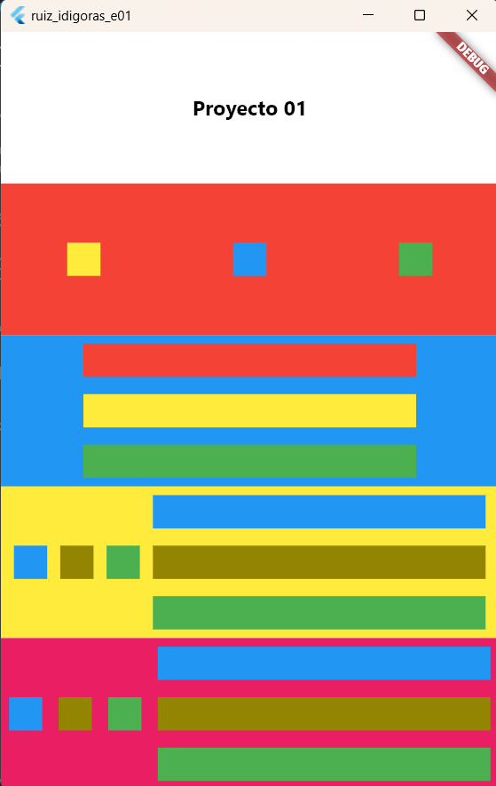

# ruiz_idigoras_e01

A new Flutter project.

## Getting Started

This project is a starting point for a Flutter application.

A few resources to get you started if this is your first Flutter project:

- [Lab: Write your first Flutter app](https://docs.flutter.dev/get-started/codelab)
- [Cookbook: Useful Flutter samples](https://docs.flutter.dev/cookbook)

For help getting started with Flutter development, view the
[online documentation](https://docs.flutter.dev/), which offers tutorials,
samples, guidance on mobile development, and a full API reference.

Este es un proyecto simple en Flutter que representa una interfaz con cinco rectángulos de diferentes colores y disposiciones. Cada rectángulo contiene elementos específicos, como texto y formas geométricas, siguiendo un diseño predefinido.

El proyecto utiliza Flutter, un framework de desarrollo de aplicaciones móviles de código abierto. En la aplicación, se definen cinco rectángulos con contenido diverso, como texto, cuadrados y rectángulos, cada uno con un color diferente. Estos rectángulos están organizados verticalmente en la pantalla y se utilizan varios widgets de Flutter para lograr la disposición y estilo deseados.

Estructura del Proyecto
lib/main.dart: Contiene el código principal de la aplicación Flutter.
README.md: Este archivo que proporciona información sobre el proyecto.
Uso
Asegúrate de tener Flutter instalado en tu máquina.
Clona este repositorio en tu entorno de desarrollo.
Abre una terminal en la carpeta del proyecto y ejecuta flutter run para iniciar la aplicación en un emulador o dispositivo conectado.
Personalización
Si deseas personalizar el proyecto, puedes ajustar los colores, tamaños y disposiciones de los elementos dentro de los rectángulos. El código está estructurado de manera modular, lo que facilita la modificación de los diferentes elementos.

dart
Copy code
// Ejemplo de personalización cambiando el color de fondo del primer rectángulo
Expanded(
  child: _buildColoredRectangle('Proyecto 01', Colors.red),
),

// Ejemplo de personalización cambiando el color de fondo del segundo rectángulo
Expanded(
  child: Container(
    color: Colors.green,
    child: Row(
      // ...
    ),
  ),
),

// ... y así sucesivamente
